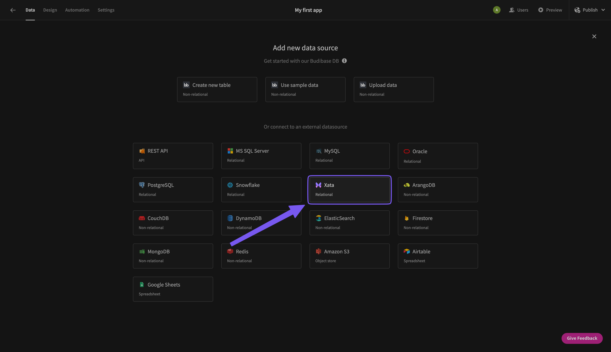

# budibase-datasource-xata
A [Budibase](https://budibase.com/) `DatasourcePlus`[^1] plugin for [Xata](https://xata.io).

[^1]: This is actually one of the first (the first? [budibase/budibase#11868](https://github.com/Budibase/budibase/pull/11868#issuecomment-1735265436),[budibase/budibase#11867](https://github.com/Budibase/budibase/issues/11867#issuecomment-1735657974)) `DatasourcePlus` plugins for Budibase, as they are not yet officially supported. [Samuel-Martineau/budibase/allow-plugins-contribute-datasourceplus](https://github.com/Samuel-Martineau/budibase/tree/allow-plugins-contribute-datasourceplus) is a Budibase fork with support for those advanced plugins. This special kind of plugin is required to provide deep integration between Budibase and Xata, notably schema fetching and automatic tabular view.
